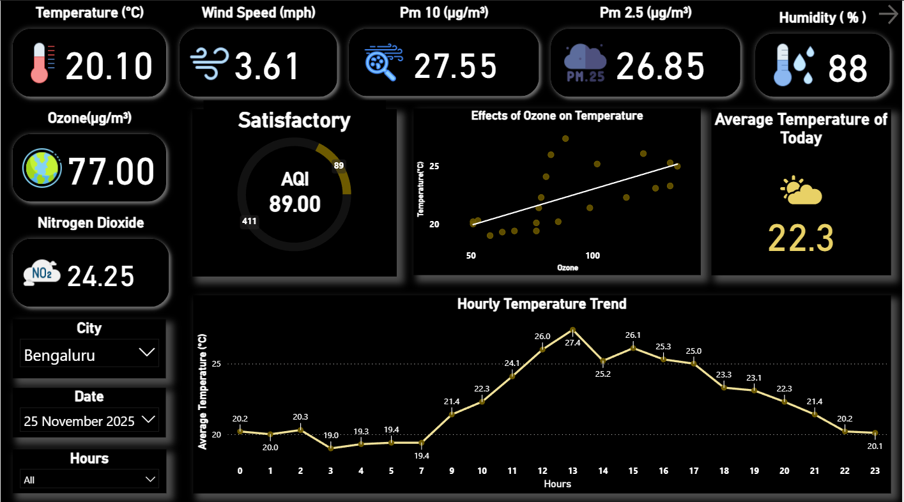
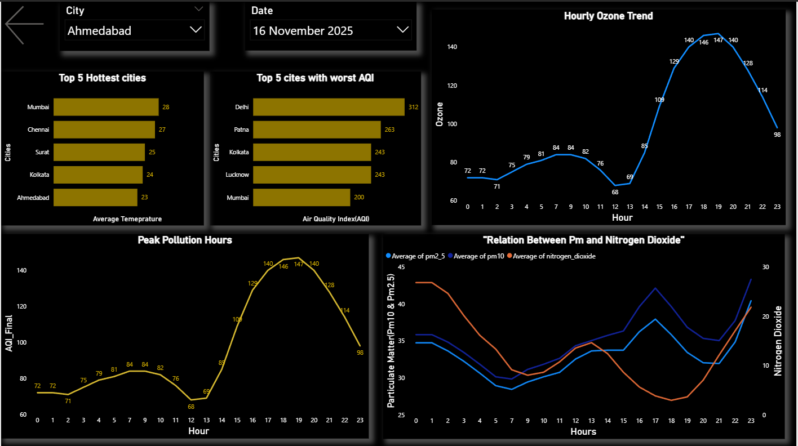

# Weather Monitoring Project

## 📝 Introduction
This project is an end-to-end **weather and AQI monitoring system** that collects hourly data for multiple Indian cities, stores it in a **NeonDB PostgreSQL database**, and provides insights through **Jupyter Notebooks** and **Power BI dashboards**.  
It is fully automated using **GitHub Actions**, making it a scalable and production-ready system.

---

## 📁 Repository Structure
- `.github/workflows/` — GitHub Actions automation  
- `Data/` — Raw and cleaned data files  
- `jupyter_notebooks/` — EDA and data cleaning notebooks  
- `powerbi/` — Power BI dashboard files  
- `scripts/` — Ingestion and utility scripts  
- `requirements.txt` — All Python dependencies  
- `.env
` — Template for environment variables  
- `.gitignore` — Ignore rules  

---

## 🧰 Tech Stack

### **Languages & Libraries**
- **Python** (requests, pandas, SQLAlchemy, matplotlib, seaborn)
- **Jupyter Notebook** for EDA

### **Database & Infra**
- **NeonDB (PostgreSQL)** — cloud-based database
- **GitHub Actions** — CI/CD automation for hourly data ingestion

### **Visualization**
- **Power BI** — dashboards and KPI analysis
- **Matplotlib & Seaborn** — visual exploration in notebooks

---

## 📘 What I Learned
Through this project, I gained experience in:
- Working with **APIs** and handling real-world weather + AQI data
- Writing **ETL pipelines** for hourly ingestion  
- Using **SQLAlchemy** + PostgreSQL for structured storage  
- Automating tasks with **GitHub Actions**  
- Cleaning and analyzing time-series datasets  
- Designing dashboards to tell a story through data  
- Organizing a production-like project structure on GitHub  

---

## 🔄 Workflow (How the System Works)

1. **API Request:**  
   The ingestion script fetches weather and AQI data for 15 cities.I used **weatherapi** key(free one) in this project

2. **Validation & Cleaning:**  
   Raw JSON is converted into a DataFrame, cleaned, validated, and standardized.

3. **Database Insertion:**  
   Clean records are inserted into **NeonDB** using SQLAlchemy.

4. **Automation:**  
   GitHub Actions triggers the script every hour.

5. **Analysis:**  
   Jupyter notebooks handle cleaning, EDA, and insights.

6. **Visualization:**  
   Power BI dashboards display the latest trends, KPIs, city comparisons, etc.

---

## 🛠️ What I Have Done & How I Did It

### ✔️ Built an Automated Weather & AQI Data Pipeline  
- Created a Python script to fetch weather and AQI data for multiple cities(Which i upgrade using AI.)
- Cleaned and validated the raw JSON response  
- Inserted structured records into a PostgreSQL database  

### ✔️ Implemented a Complete CI/CD Flow  
- Used GitHub Actions to run the ingestion script **every hour**  
- Actions handle environment variables & database credentials securely  

### ✔️ Designed EDA Notebooks  
- Cleaned missing values  
- Analyzed trends: temperature, humidity, AQI levels  
- Built comparative city plots and correlations  

### ✔️ Created Interactive Power BI Dashboards  
- Hourly weather trends  
- AQI variation and critical alerts  
- KPIs for pollution spikes  
- City-level comparisons  

---

## 📂 Direct Links to Important Files

### 🔗 **Jupyter Notebooks**
- [EDA Notebook](jupyter_notebooks/02_cleaning_data.ipynb)  
- [Cleaning Notebook](jupyter_notebooks/03_exploratory_data_analysis.ipynb)  
- [Insight 1 Notebook](jupyter_notebooks/04_pollution_relationship.ipynb)
- [Insight 2 Notebook](jupyter_notebooks/05_weather_and_pollution.ipynb)

### 🔗 **Scripts**
- [Python Script](scripts/weather_aqi_fetch.py)  

### 🔗 **GitHub Actions Workflow**
- [Hourly Automation Workflow](.github/workflows/weather_run.yml)
---

## 📊 Dashboards (Preview)

### 🌡️ Weather & AQI Dashboard

## 🚀 Future Enhancements & Upscaling

### **1. Add more cities and countries**
The pipeline can support dozens of cities by simply adding them to the fetch script.

### **2. Build a web dashboard**
A full stack dashboard using:
- FastAPI / Flask backend  
- React / Streamlit frontend  

### **3. Implement alerting system**
Send:
- Email alerts  
- Telegram bot notifications  
when AQI crosses thresholds.

### **4. Store historical data efficiently**
Shift to:
- Snowflake  
- BigQuery  
- AWS Redshift  
for large-scale time-series storage.

### **5. Add caching & rate-limit handling**
Use Redis or in-memory caching to prevent API overuse.

---

## 🧩 Use Cases

### ✔️ **Real-time Environment Monitoring**
Cities or organizations can monitor live AQI and temperature conditions.

### ✔️ **Government & Municipal Dashboards**
Track air pollution levels and weather fluctuations throughout the day.

### ✔️ **Health Advisory Systems**
Issue alerts for:
- Sensitive groups  
- High AQI risk zones  

### ✔️ **Research & Analysis**
Useful for:
- Climate studies  
- AQI pattern research  
- Seasonal behavior analysis  

### ✔️ **Scalable Backend for Weather Apps**
This pipeline can be the backend for a real mobile app.

---

## 📌 Summary
This project showcases skills in:
- Automation  
- Databases  
- APIs  
- EDA  
- Dashboard building  
- Clean project architecture  

It is fully scalable and can grow into a full-fledged analytics platform.

